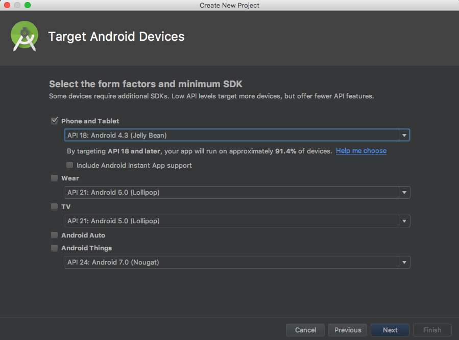

# Android - Getting Started

## Android - Getting Started

### Prerequisites

* Android IDE\(Integrated Development Environment, _Android Studio_\)
* minSdkVersion 18 or higher
* java 1.8 or higher

### Creating and Configuring a New Project

#### Create a project and set the API level

Set the Android version to _API Level 18 or higher_.



#### Compatibility Settings

In the _Open Module Settings_, set the _Source Compatibility_ and _Target Compatibility_ to 1.8 or higher.


#### Module Gradle Settings

Edit the `build.gradle(Module:app)` to add the following in the `dependencies` section.

```groovy
dependencies {
    /* RemoteMonster SDK */
    api 'com.remotemonster:sdk:2.0.12'
}
```

#### Permission Settings

For the latest version of Android, the user will be directly asked about the permissions when using the app for the first time. The permissions to be handled are as follows:

```java
public static final String[] MANDATORY_PERMISSIONS = {
  "android.permission.INTERNET",
  "android.permission.CAMERA",
  "android.permission.RECORD_AUDIO",
  "android.permission.MODIFY_AUDIO_SETTINGS",
  "android.permission.ACCESS_NETWORK_STATE",
  "android.permission.CHANGE_WIFI_STATE",
  "android.permission.ACCESS_WIFI_STATE",
  "android.permission.READ_PHONE_STATE",
  "android.permission.BLUETOOTH",
  "android.permission.BLUETOOTH_ADMIN",
  "android.permission.WRITE_EXTERNAL_STORAGE"
};
```

### Development

Now you are ready for development. Refer to the following for detailed development methods.

#### Service Key

To access the _RemoteMonster_ broadcast and communications infrastructure through the SDK, Service Id and Key are required. For simple testing and demonstration, you can skip this step. In order to develop and operate the actual service, please refer to the following to acquire and apply the Service Id and Key.



#### Broadcast

`RemonCast` can make broadcasting functions easy and fast.

**Broadcast Transmission**

```java
caster = RemonCast.builder()
    .context(CastActivity.this)
    .localView(surfRendererlocal)          // Self Video Renderer
    .build();
caster.create();
```

**Broadcast Viewing**

```java
viewer = RemonCast.builder()
    .context(ViewerActivity.this)
    .remoteView(surfRendererRemote)        // broadcaster’s Video Renderer
    .build();
viewer.join("CHANNEL_ID");                 // The channel you want to join
```

Or refer to the following for more details.



#### Communication

`RemonCall` can make communication functions easy and fast.

```java
remonCall = RemonCall.builder()
    .context(CallActivity.this)        
    .localView(surfRendererLocal)        //My Video Renderer
    .remoteView(surfRendererRemote)      //The other video Renderer
    .build();
remonCall.connect("CHANNEL_ID")
```

Or refer to the following for more details.



