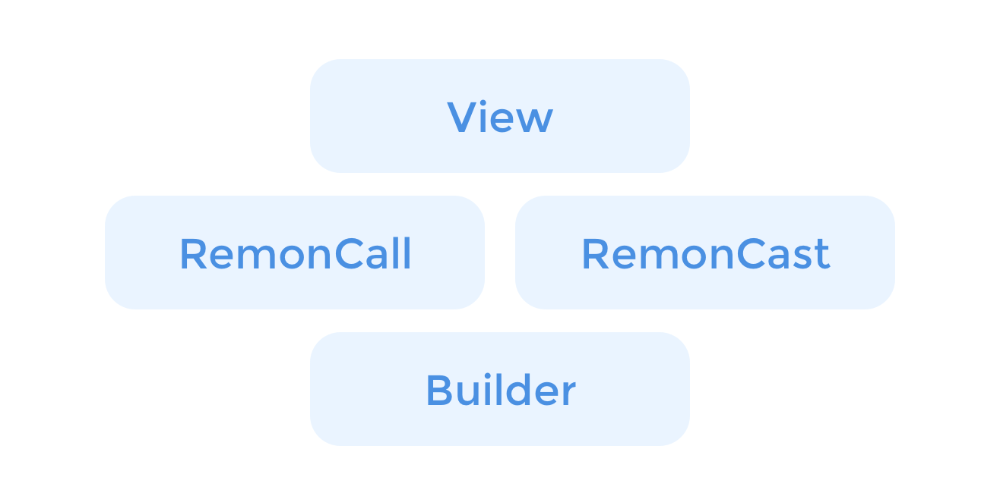

# Android - Overview

## Overview

`Remon` is the most important class in the _Remon SDK_. `Remon Config` and `Remon Observer` can be used for direct broadcasting and communication. `RemonCall` and `RemonCast` that contain complex and repetitive basic operations are provided. These enable broadcasting and communication functions to be implemented.

## Resources

### Downloads, Change Log, Examples



All information about the _RemoteMonster Android SDK_ is available. Check various code examples.

### Reference Document



There is a detailed description of the SDK features.

