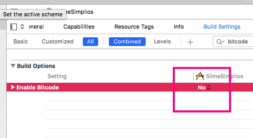
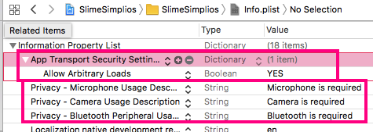
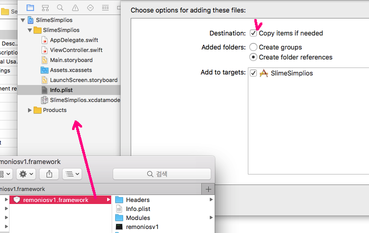
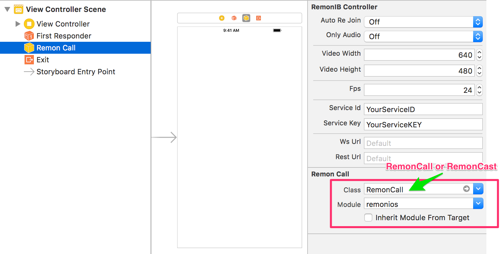
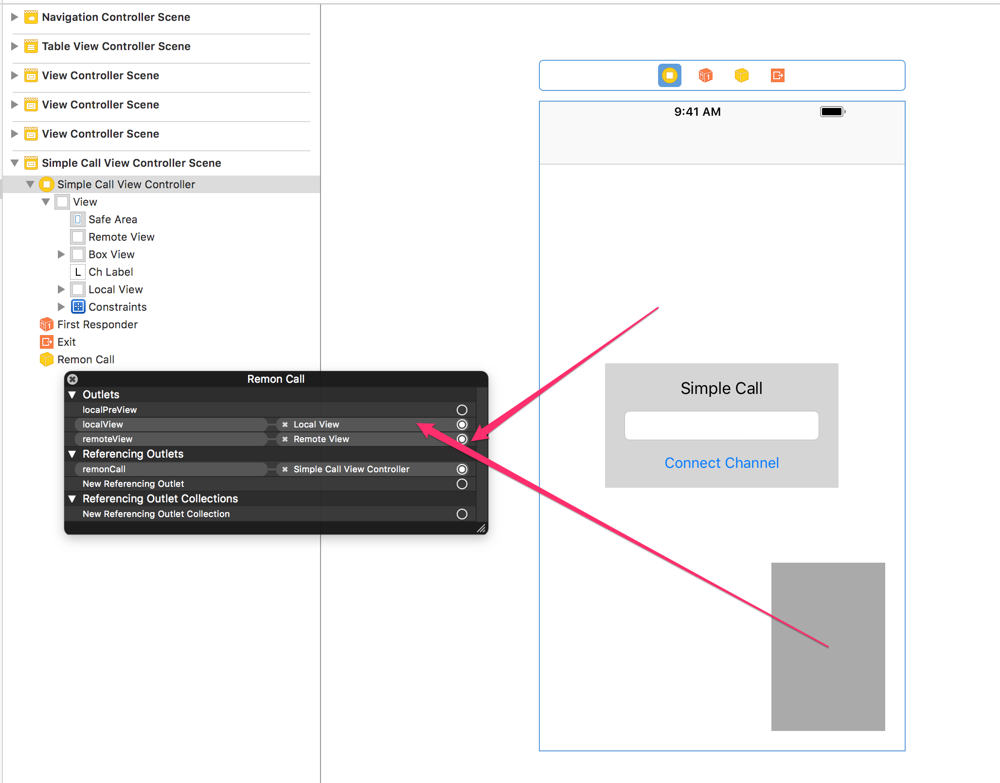
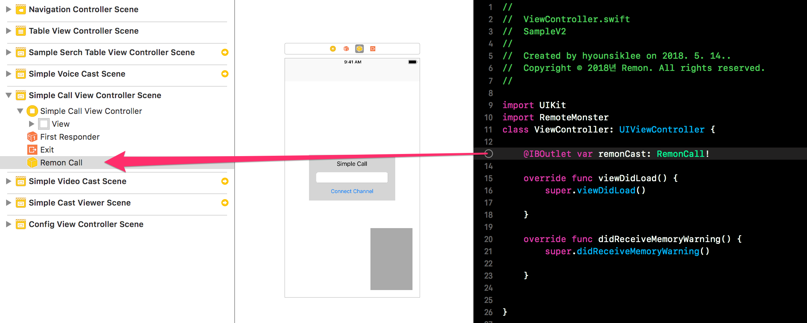
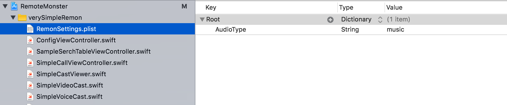
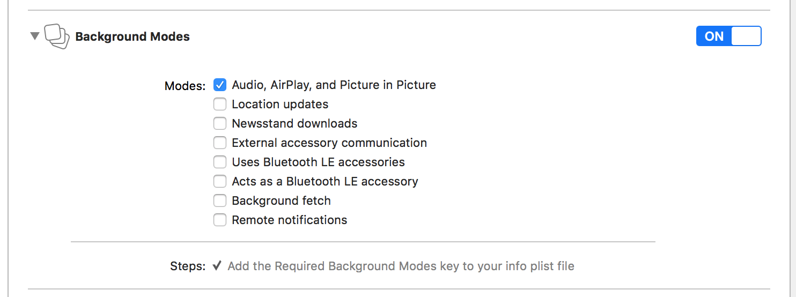

# iOS - Getting Started

## iOS - Getting Started

### Prerequisites

* Xcode IDE
* iOS 9.2 or later

### Creating and Configuring a New Project

Create a new _Swift_-based project in Xcode.

You need to set `No` to the `Enable Bitcode` option in the `Build Settings` after project creation.



You also need to add or change the following items in `Info.plist`.



### SDK Installation - Cocoapods

Add `pod 'RemoteMonster', '~> 2.0'` to the `Podfile` of the project in which you want to install the SDK.



```text
target 'MyApp' do
  pod 'RemoteMonster', '~> 2.0'
end
```



Then run `pod install` on the terminal. If `pod install` does not work, run `pod update`.

```bash
$ pod install
```

### SDK Installation - Direct Import

First, download the latest version of the iOS SDK via the link below.



There are two frameworks when I unzip the downloaded _RemoteMonster iOS SDK_. Drag and drop each _Framework_ from the _Finder_ to the _Project Tree_ pane. You will then see the _RemoteMonster SDK_ recognized as a framework.



### Remon Setup and Layout Configuration

With `InterfaceBuilder`, `Remon` can be configured by using `RemonIBController`.

* Add a subobject of RemonIBController \(RemonCall or RemonCast\) to the storyboard.
  * `RemonCall` supports 1:1 communication and `RemonCast` supports 1: N broadcasting.
  * Use `Utilities` view to configure `Remon` in _InterfaceBuilder_.
* Set `ServiceID` and `Service Key`.
  * If you want to run a test simply, you do not need to enter anything.
  * If you consider actual service, please refer to the following and get the service key to use.





* Place `View` at the desired location in the desired scene in the storyboard, and bind it to the `remoteView` and `localView` of the `RemonIBController`.



* Import the _RemoteMonster SDK_ into the `ViewContoller` using `Remon`, and bind the `RemonIBController` object to an outlet variable.



### Development

Now you are ready for development. Refer to the following for detailed development methods.

#### Broadcast

`RemonCast` can make broadcasting functions easy and fast.

**Broadcast Transmission**

```swift
let caster = RemonCast()
caster.create()
```

**Broadcast Viewing**

```swift
let viewer = RemonCast()
viewer.join("CHANNEL_ID")
```

Or refer to the following for more details.



#### Communication

`RemonCall` can make communication functions easy and fast

```swift
let remonCall = RemonCall()
remonCall.connect("CHANNEL_ID")            // Communication
```

Or refer to the following for more details.



### Known Caveats

#### Audio Types

There are two types of audio in _Remon_: _voice_ and _music_. The default operation mode is _voice_, and you can use the _music_ mode if you want to use various sounds rather than voice. In particular, the _music_ mode tends to be more suitable for the broadcast.



Add the `RemonSettings.plist` file to your project and change the _AudioType_ value to the desired mode.

#### Background Mode Support

If you need to constantly connect to the SDK in the background, you can set the option in the following menu: _Project&gt; Targets&gt; Capabilities&gt; Background Modes_. If you do not set the background mode, the connection with _RemoteMonster_ will be terminated and the broadcast and call will be ended when the app moves to the background.



Please refer to the following for background mode support.



