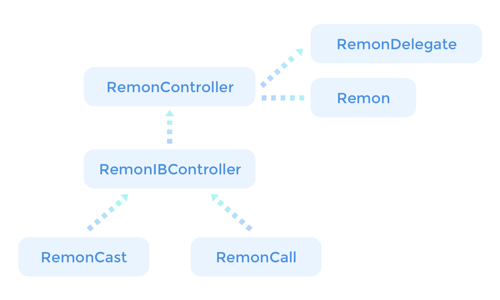

# iOS - Overview

## Overview

`Remon` is the core class in the _RemoteMonster SDK_. You can use the class `Remon` and implement `RemonDelegate` yourself to take advantage of the communication and broadcasting capabilities provided by `Remon`, but this will be a complicated and tedious task. Therefore, to enable SDK users to use `Remon` more easily and quickly, there are the following two classes available: `RemonController` containing complicated and repetitive basic operations and `RemonIBController` used for Interface Builder support. If you use the `RemonController` class, you only need to implement additional required parts instead of implementing complex `RemonDelegate` methods.

## Resources

### Downloads, Change Log, Examples



All information about the _RemoteMonster iOS SDK_ is available. Check various code examples.

### Reference Document



There is a detailed description of the SDK features.

